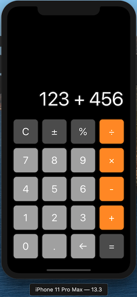

# File for testing MD syntax

### Headings:

```
# Heading-1
## Heading-2
### Heading-3
```
# Heading-1
## Heading-2
### Heading-3
---

### Styling of text

```
Example of text styling **this is bold** and *this is italic*. This is ***bold and italic***. To force a newline  
Inset two spaces at the end of the previous line.
```
Example of text styling **this is bold** and *this is italic*. This is ***bold and italic***. To force a newline  
Inset two spaces at the end of the previous line.

To insert inline code use the `single backtick`. Text in backtik will not be formatter

To quote use >
>this is a quote  
multiple lines


---
### Links:

```
[Example of a link](https://help.github.com/en/github/writing-on-github/basic-writing-and-formatting-syntax)
```
This is an [Example of a link](https://help.github.com/en/github/writing-on-github/basic-writing-and-formatting-syntax)

---
### List:

- unordered item1
  - unordered nested item 1
    - and even deeper
- unordered item2

10. ordered item
0. ordered item, note only the first order value is important
0. this value is set to 0, but shows the correct order when formatted

---
### Table:

This table is copied from [here](https://guides.github.com/features/mastering-markdown/#examples)

First Header | Second Header
------------ | -------------
Content from cell 1 | Content from cell 2
Content in the first column | Content in the second column

---
### Image

```

```


---
References:  
https://help.github.com/en/github/writing-on-github/basic-writing-and-formatting-syntax
https://guides.github.com/features/mastering-markdown/#examples
